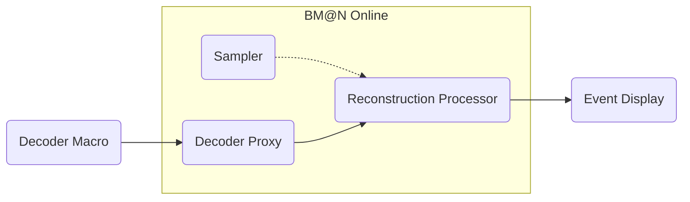

# BM@N Online

## Structure



### Decoder Proxy

It converts the data sent by the [Decoder Macro](/macro/monitor/monStreamDecoder.C) into a format convenient for the [Reconstruction Processor](#reconstruction-processor).

#### Usage

```bash
bmn-online-decoder-proxy --id <DEVICE_ID> --channel-config name=in-channel,type=sub,method=connect,address=<INPUT_ADDRESS>,rateLogging=0 name=out-channel,type=pub,method=bind,address=<OUTPUT_ADDRESS>,rateLogging=0 --control static
```

#### Required parameters

| Parameter | Example | Description |
| --- | --- | --- |
| `<DEVICE_ID>` | decoder-proxy-1 | Device ID. |
| `<INPUT_ADDRESS>` | tcp://localhost:5555 | URL to retrieve data[^open-port]. |
| `<OUTPUT_ADDRESS>` | tcp://localhost:5556 | URL where the channel for data transfer will be opened[^open-port]. |

#### Example

```bash
bmn-online-decoder-proxy --id decoder-proxy-1 --channel-config name=in-channel,type=sub,method=connect,address=tcp://localhost:5555,rateLogging=0 name=out-channel,type=pub,method=bind,address=tcp://localhost:5556,rateLogging=0 --control static
```

### Sampler

Allows you to simulate the operation of the [Decoder Proxy](#decoder-proxy) by extracting data from a digi file.

#### Usage

```bash
bmn-online-sampler --id <DEVICE_ID> --channel-config name=out-channel,type=pub,method=bind,address=<OUTPUT_ADDRESS>,rateLogging=0 --control static --file-path <FILE_PATH>
```

#### Required parameters

| Parameter | Example | Description |
| --- | --- | --- |
| `<DEVICE_ID>` | sampler-1 | Device ID. |
| `<OUTPUT_ADDRESS>` | tcp://localhost:5556 | URL where the channel for data transfer will be opened[^open-port]. |
| `<FILE_PATH>` | | Path to a digi file. |

#### Example

```bash
bmn-online-sampler --id sampler-1 --channel-config name=out-channel,type=pub,method=bind,address=tcp://localhost:5556,rateLogging=0 --control static --file-path <FILE_PATH>
```

#### Optional options

| Option | Default value | Description |
| --- | --- | --- |
| `--dispatch-delay` | 1000 | Delay between sending the next event (set in milliseconds). |
| `--start-event` | 0 | Event number from which sending starts. |

### Reconstruction Processor

Performs reconstruction of received data. Based on the [Reconstruction Macro](/macro/run/run_reco_bmn.C).

#### Usage

```bash
bmn-online-reco-processor --id <DEVICE_ID> --channel-config name=in-channel,type=sub,method=connect,address=<INPUT_ADDRESS>,rateLogging=0 name=out-channel,type=pub,method=bind,address=<OUTPUT_ADDRESS>,rateLogging=0 --control static
```

#### Required parameters

| Parameter | Example | Description |
| --- | --- | --- |
| `<DEVICE_ID>` | reco-processor-1 | Device ID. |
| `<INPUT_ADDRESS>` | tcp://localhost:5556 | URL to retrieve data[^open-port]. |
| `<OUTPUT_ADDRESS>` | tcp://localhost:5557 | URL where the channel for data transfer will be opened[^open-port]. |

#### Example

```bash
bmn-online-reco-processor --id reco-processor-1 --channel-config name=in-channel,type=sub,method=connect,address=tcp://localhost:5556,rateLogging=0 name=out-channel,type=pub,method=bind,address=tcp://localhost:5557,rateLogging=0 --control static
```

[^open-port]: Make sure that the port is open in the firewall.
